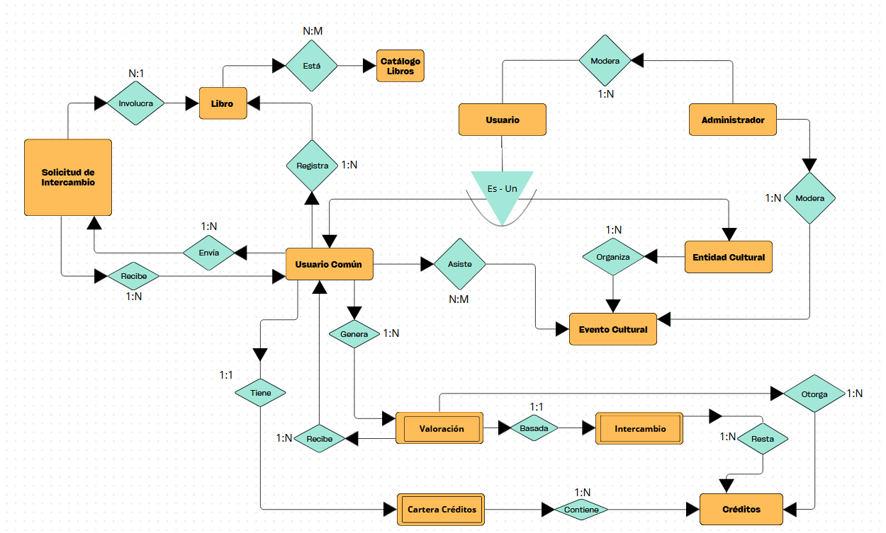

# DIAGRAMA DE ENTIDAD - RELACIÓN

En el siguiente apartado se presenta el modelo de entidad-relación de la plataforma BookSwap, donde se representan las entidades como rectángulos y las relaciones como rombos. 

De dicho diagrama se han creado diversas tablas, las cuales son:

### A) Tabla de Administrador:

| Atributo              | Tipo    | Tamaño | Clave | Descripción                                                  |
|-----------------------|---------|--------|-------|--------------------------------------------------------------|
| id_admin              | INT     | -      | PK    | Identificador único de Administrador                         |
| nombre_admin          | VARCHAR | 100    | -     | Nombre del administrador                                     |
| apellidos_admin       | VARCHAR | 100    | -     | Apellidos del administrador                                  |
| email_admin           | VARCHAR | 100    | -     | Correo electrónico de acceso                                 |
| pass_admin            | VARCHAR | 255    | -     | Contraseña cifrada                                           |
| telefono_admin        | VARCHAR | 11     | -     | Número telefónico del administrador                          |
| ciudad_admin          | VARCHAR | 100    | -     | Ciudad de residencia o gestión                               |

### B) Tabla de Usuario_comun:

| Atributo                  | Tipo     | Tamaño | Clave | Descripción                                                                 |
|---------------------------|----------|--------|-------|-----------------------------------------------------------------------------|
| id_user_comun             | INT      | -      | PK    | Identificador único de usuario común                                        |
| nombre_user_comun         | VARCHAR  | 100    | -     | Nombre del usuario común                                                    |
| apellidos_user_comun      | VARCHAR  | 100    | -     | Apellidos del usuario común                                                 |
| email_user_comun          | VARCHAR  | 100    | -     | Correo electrónico de acceso                                                |
| pass_user_comun           | VARCHAR  | 255    | -     | Contraseña cifrada                                                          |
| telefono_user_comun       | VARCHAR  | 11     | -     | Número telefónico del usuario común                                         |
| ciudad_user_comun         | VARCHAR  | 100    | -     | Ciudad de residencia o gestión                                              |
| id_admin                  | INT      | -      | FK    | Identificador único del administrador que modera al usuario                 |

### C) Tabla de Entidad_cultural:

| Atributo                        | Tipo    | Tamaño | Clave | Descripción                                                                 |
|---------------------------------|---------|--------|-------|-----------------------------------------------------------------------------|
| id_entidad_cultural             | INT     | -      | PK    | Identificador único de entidad cultural                                     |
| nombre_entidad_cultural         | VARCHAR | 100    | -     | Nombre de la entidad cultural                                               |
| email_entidad_cultural          | VARCHAR | 100    | -     | Correo electrónico de acceso                                                |
| pass_entidad_cultural           | VARCHAR | 255    | -     | Contraseña cifrada                                                          |
| telefono_entidad_cultural       | VARCHAR | 11     | -     | Número telefónico de la entidad cultural                                    |
| ciudad_entidad_cultural         | VARCHAR | 100    | -     | Ciudad de residencia o gestión                                              |
| id_admin                        | INT     | -      | FK    | Identificador único del administrador que modera a la entidad cultural      |

### D) Tabla de Libro:

| Atributo                 | Tipo     | Tamaño | Clave | Descripción                                                        |
|--------------------------|----------|--------|-------|--------------------------------------------------------------------|
| id_libro                 | INT      | -      | PK    | Identificador único del libro                                      |
| titulo_libro             | VARCHAR  | 100    | -     | Título del libro                                                   |
| autor_libro              | VARCHAR  | 100    | -     | Autor del libro                                                    |
| ISBN                     | VARCHAR  | 255    | -     | ISBN del libro                                                     |
| estado_libro             | VARCHAR  | 100    | -     | Estado en el que se encuentra el libro                             |
| genero_libro             | VARCHAR  | 100    | -     | Género literario para clasificar al libro                          |
| fecha_publicacion_libro  | DATE     | -      | -     | Fecha en la que se publicó el libro                                |
| id_user_comun            | INT      | -      | FK    | Identificador único del usuario común que lo registró              |

### E) Tabla de Evento_cultural:

| Atributo            | Tipo     | Tamaño | Clave | Descripción                                                                         |
|---------------------|----------|--------|-------|-------------------------------------------------------------------------------------|
| id_evento           | INT      | -      | PK    | Identificador único del evento                                                      |
| nombre_evento       | VARCHAR  | 150    | -     | Nombre del evento                                                                   |
| fecha_evento        | DATE     | -      | -     | Fecha de realización del evento                                                     |
| descripcion_evento  | TEXT     | -      | -     | Descripción del evento                                                              |
| ubicacion_evento    | VARCHAR  | 150    | -     | Lugar donde se va a realizar el evento                                              |
| tipo_evento         | ENUM     | -      | -     | Tipo de evento  ('encuentro con el autor', 'club de lectura', 'feria del libro')    |
| estado_evento       | VARCHAR  | 50     | -     | Estado actual del evento (pendiente, aceptado, rechazado)                           |
| id_entidad_cultural | INT      | -      | FK    | Identificador único de la entidad que lo organiza                                   |
| id_administrador    | INT      | -      | FK    | Identificador único del administrador que lo modera                                 |

### F) Tabla de Cartera_creditos:

| Atributo       | Tipo     | Tamaño | Clave | Descripción                                                        |
|----------------|----------|--------|-------|--------------------------------------------------------------------|
| id_cartera     | INT      | -      | PK    | Identificador único de la cartera                                  |
| saldo_total    | DECIMAL  | 10.2   | -     | Saldo total disponible                                             |
| id_user_comun  | INT      | -      | FK    | Identificador único del usuario común dueño de la cartera          |

### G) Tabla de Movimiento_creditos:

| Atributo          | Tipo     | Tamaño | Clave | Descripción                                                  |
|-------------------|----------|--------|-------|--------------------------------------------------------------|
| id_movimiento     | INT      | -      | PK    | Identificador único del movimiento de crédito                |
| cantidad          | DECIMAL  | 10.2   | -     | Cantidad de créditos                                         |
| tipo_movimiento   | ENUM     | -      | -     | Tipo de movimiento (ganado, gastado, otorgado)               |
| fecha_movimiento  | DATE     | -      | -     | Fecha del ingreso o retirada de los créditos                 |
| id_cartera        | INT      | -      | FK    | Identificador único de la cartera asociada                   |

