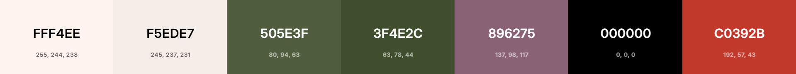

# Guia de estilo de BookSwap

Esta guia sirve como referencia para establecer los estilos visuales (colores, tipografía, etc.) de la aplicación web BookSwap. El objetivo es asegurar la coherencia y facilitar la implementación de la interfaz de usuario.

## Identidad visual

BookSwap es una aplicación de intercambio de libros que busca transmitir cercanía y pasión por la lectura. Su identidad visual se basa en valores como la sostenibilidad, cultura, cercanía y confianza con un estilo editorial.

## Paleta de colores

La gama de colores escogida para BookSwap está formada por seis colores seleccionados con cuidado y que equilibran la naturaleza y la cultura. Esta diversidad posibilita la creación de una interfaz que sea consistente, accesible y que esté alineada desde el punto de vista emocional con los valores de la aplicación.

BookSwap es una aplicación de intercambio de libros que busca transmitir altruismo, cercanía y pasión por la lectura. Su identidad visual se basa en valores como la sostenibilidad y la cultura.

## Paleta de colores

La gama de colores escogida para BookSwap está formada por seis colores que equilibran la naturaleza (tono verdes) y la cultura (tonos morados). Esta diversidad posibilita la creación de una interfaz que sea consistente, accesible y que esté alineada desde el punto de vista emocional con los valores de la aplicación.

| Color | Funcionalidad |
| --- | --- |
| **FFF4EE** | Fondo principal |
| **F5EDE7** | Fondo alterno / tarjetas |
| **505E3F** | Hover / Botones activados |
| **3F4E2C** | Color base |
| **896275** | Color de contraste |
| **000000** | Texto principal |
| **C0392B** | Acciones negativas |

La paleta de colores se ha obtenido gracias a la web Coolors, que permite jugar con distintas combinaciones de colores.

## Tipografía

BookSwap utiliza una combinación tipográfica que refuerza su identidad editorial y digital. Los títulos emplean una fuente **Playfair Display** con serifas que aporta carácter y cultura, mientras que el cuerpo de texto se presenta en una fuente **Open Sans** que garantiza legibilidad y accesibilidad en todos los dispositivos. Los estilos de fuentes se han obtenido de Google Fonts.

 

## Logo

El logotipo de BookSwap ilustra la esencia de la plataforma: un libro abierto en la parte inferior que simboliza el acceso al conocimiento y la pasión por la lectura y una flecha circular encima de él que sugiere la reutilización. El uso de la tipografía serif en el nombre "BookSwap" le confiere seriedad y elegancia, lo cual enfatiza la naturaleza cultural del proyecto. El color verde representa, por otra parte, el compromiso con la sostenibilidad.

